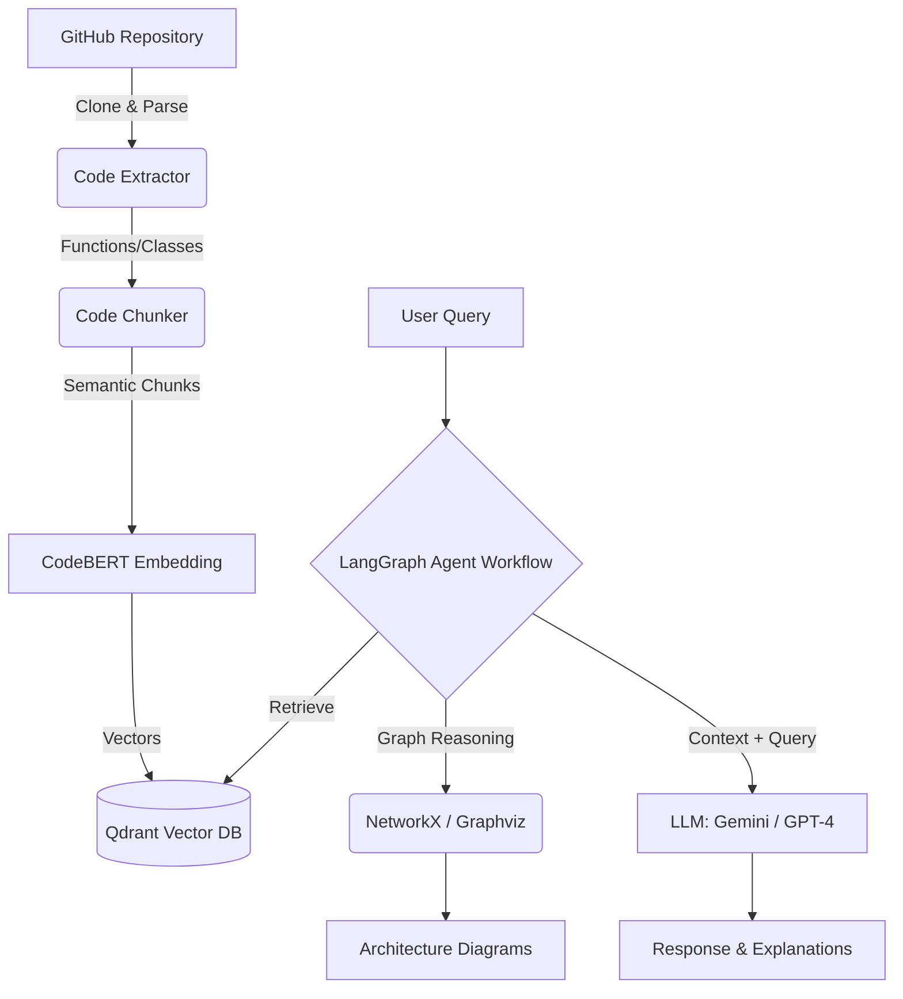

# 🧠 GitHub Repository Intelligence System

An advanced, AI-powered intelligence system designed for understanding, analyzing, and visualizing large codebases seamlessly. Leveraging **LangGraph**, **CodeBERT**, and **RAG (Retrieval-Augmented Generation)**, it acts as your personal AI architect and developer for any repository.

## 🎯 Target Audience: Who is this for?

- **Software Engineers & Developers**: Quickly onboard to new or large codebases without spending days reading code.
- **System Architects**: Automatically generate architecture and component diagrams for existing code.
- **Tech Leads & Code Reviewers**: Use AI-powered static analysis to catch bugs and analyze dependency graphs.
- **DevOps & Security Teams**: Understand flow paths and codebase structures for infrastructure planning or vulnerability scanning.

## 🚀 Key Features

- **💬 Natural Language Q&A**: Ask questions in plain English about any part of your codebase.
- **📖 Deep Code Explanations**: Get detailed, context-aware explanations of functions, classes, and complex logic.
- **🏗️ Automated Architecture Diagrams**: Auto-generate component, class, and dependency flow diagrams.
- **🐛 AI-Powered Bug Detection**: Run static analysis to detect potential issues or code smells.
- **🔍 Semantic Search**: CodeBERT-powered embedding search that understands the meaning, not just exact keywords.
- **📊 Graph-Based Dependency Analysis**: Reason over code relationships visually and logically.

## 🏛️ Architecture Workflow

Here's how the intelligence system extracts and reasons over your code:



## 🛠️ Tech Stack Used

- **Agent Orchestration**: `LangGraph`
- **LLM & Reasoning**: `Langchain`, `Google GenAI / OpenAI GPT-4`
- **Code Embeddings & Parsing**: `CodeBERT`, `SentenceTransformers`, `Tree-sitter` (for Python, JS, TS, Go, Rust)
- **Vector Database**: `Qdrant`, `ChromaDB`
- **Graph & Diagrams**: `Graphviz`, `NetworkX`, `PlantUML`
- **Backend & APIs**: `FastAPI`, `Uvicorn`
- **Web UI**: `Streamlit`
- **Version Control Integration**: `PyGithub`, `GitPython`

## ⚙️ How to Use This Repository

### 1. Clone & Setup Environment
```bash
git clone https://github.com/Hemkumar247/Repo_intelligence.git
cd Repo_intelligence

# Create a virtual environment
python -m venv venv
source venv/bin/activate  # On Windows: venv\Scripts\activate

# Install dependencies
pip install -r requirements.txt
```

### 2. Configure API Keys
Copy the example environment variables and add your tokens:
```bash
cp .env.example .env
# Edit .env and include:
# - GITHUB_TOKEN
# - OPENAI_API_KEY / GEMINI_API_KEY
# - QDRANT_URL (If using managed Qdrant)
```

### 3. Start Vector Database (Local Qdrant)
```bash
docker run -p 6333:6333 qdrant/qdrant
```

### 4. Run the Application
You can run the intelligence system through three different interfaces:

**Interactive Web UI:**
```bash
streamlit run src/ui/app.py
```

**REST API (FastAPI):**
```bash
python -m src.api
# Access the interactive Swagger docs at http://localhost:8000/docs
```

**Command Line (CLI):**
```bash
python -m src.pipeline
```

## 💡 Quick API Examples

```python
from src.pipeline import RepoIntelligencePipeline

pipeline = RepoIntelligencePipeline()

# 1. Index a Repo
pipeline.index_repository("https://github.com/torvalds/linux")

# 2. Ask Code Questions
answer = pipeline.ask("linux", "How does the scheduler work?")

# 3. Generate Architecture Diagram
arch = pipeline.generate_architecture("linux")
```

## 📜 License
This project is licensed under the MIT License.
